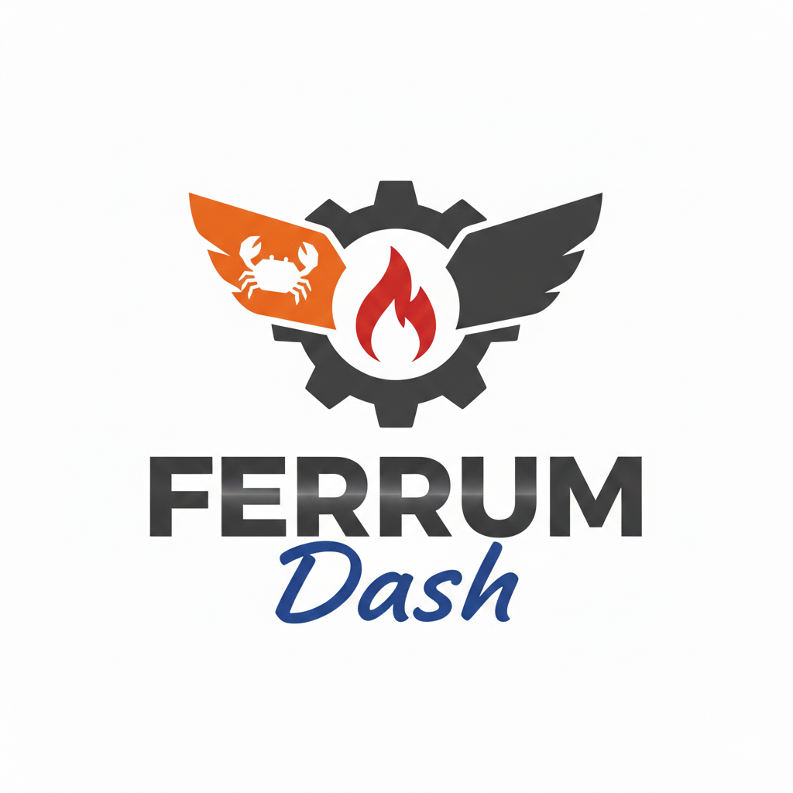
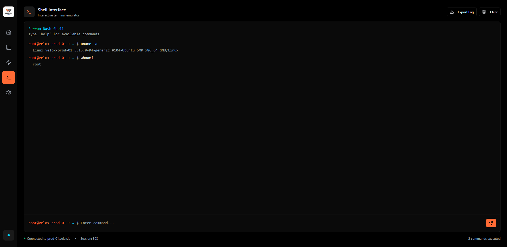
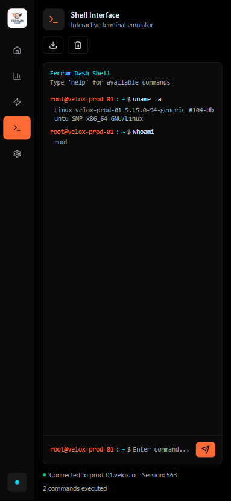
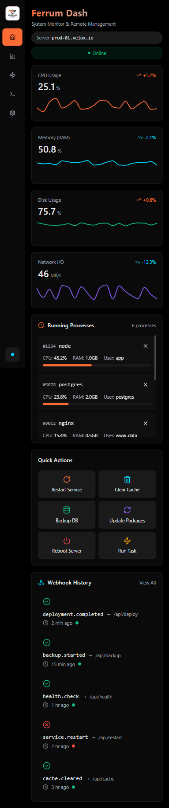
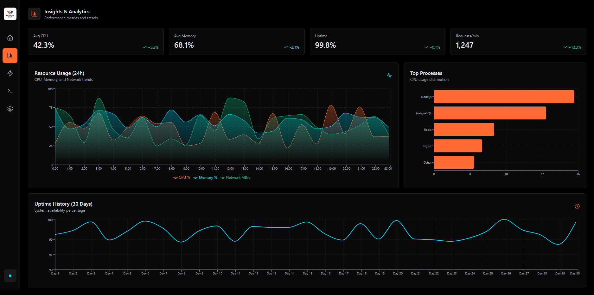
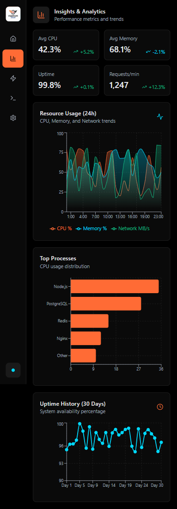
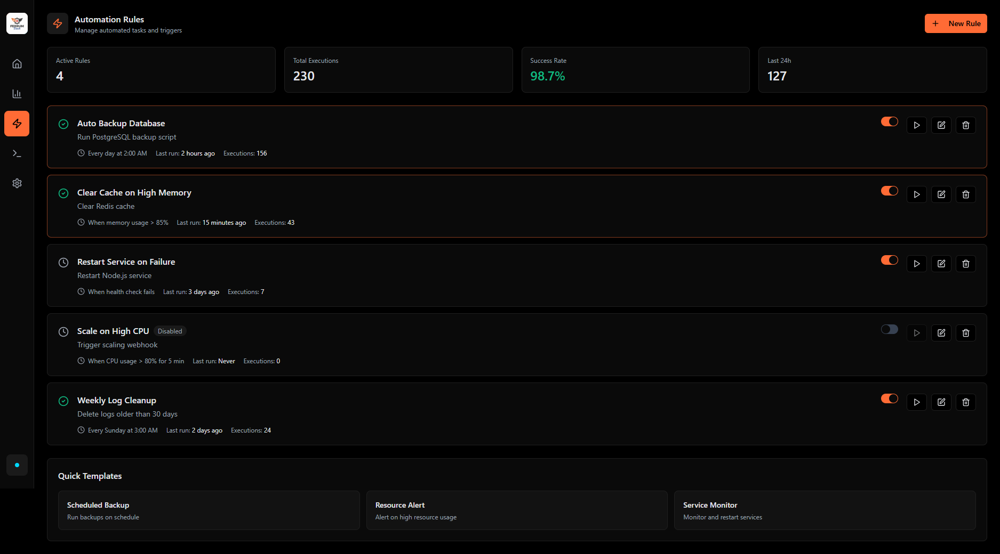
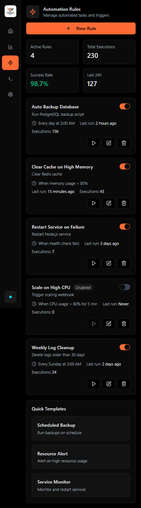
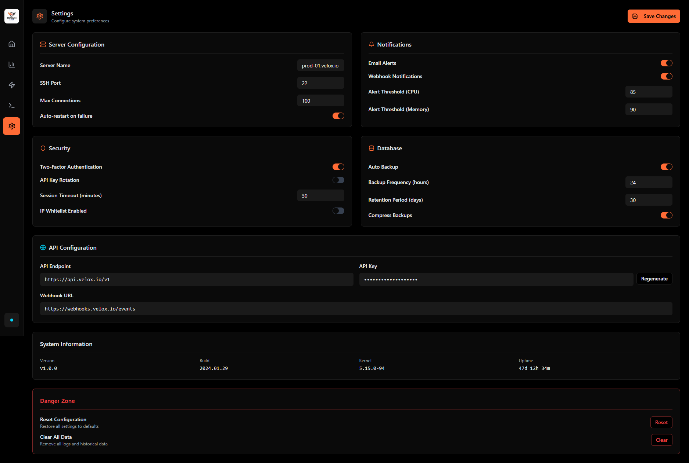
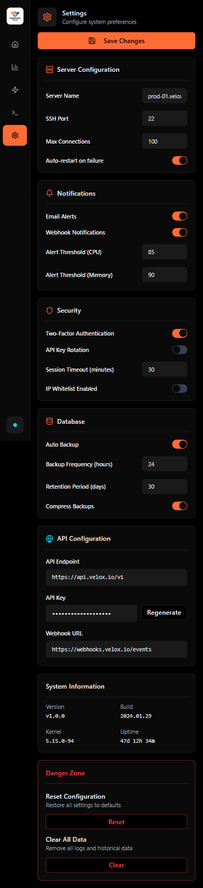

	

A lightweight, blazingly fast web-based system monitor and remote administration tool for Linux, written in Rust.

# thinking...
UX wise how should I structure this, should I go mobile first? what are the most important things you want to see in the first page? I am thinking of making it fully customizable (atleast the homescreen) and have some defaults.

home - <some category> - <some category> - <some-category> - <shell> - help

that means these components need to be dynamically loadable, what would be the database, I need something very lightweight, I was thinking about sqlite, the api will be axum and the ui will be plain svelte, all deployable via docker compose. Maybe its better to combine the frontend dist to the backend via rust-embed and embed SQLITE as well, that would make it a single binary.

Shadcn for ui components, home would be customizable so we'll use svelte components and treat everything as widgets and tailwind for styling.

# work-items
- [x] UI Mocks
- [ ] Project setup AXUM
- [ ] Project setup svelte

# UI mocks
# Screens
| Flow | Desktop | Mobile |
| --- | --- | --- |
| Shell landing |  |  |
| Home widgets |  |  |
| Insights dashboards |  |  |
| Webhooks overview |  |  |
| Settings |  |  |

